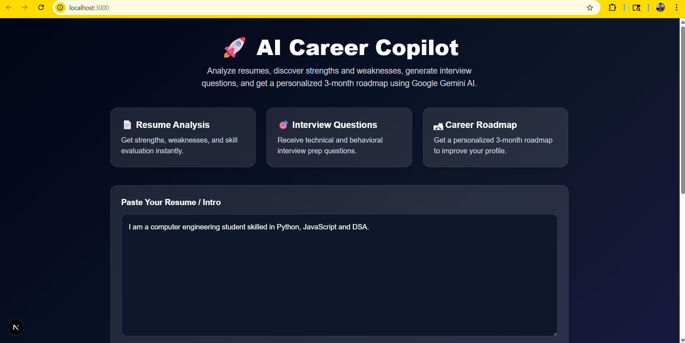
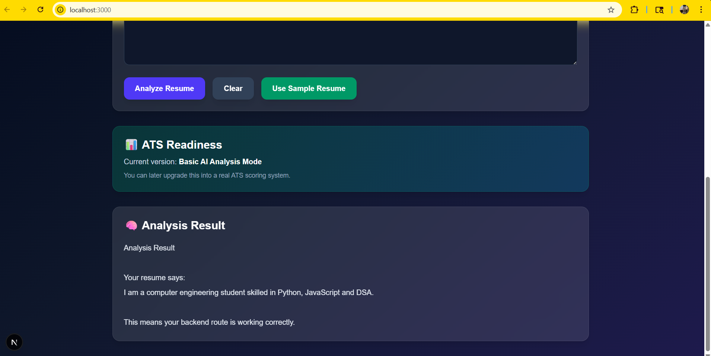
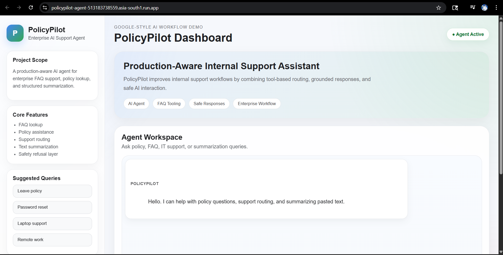
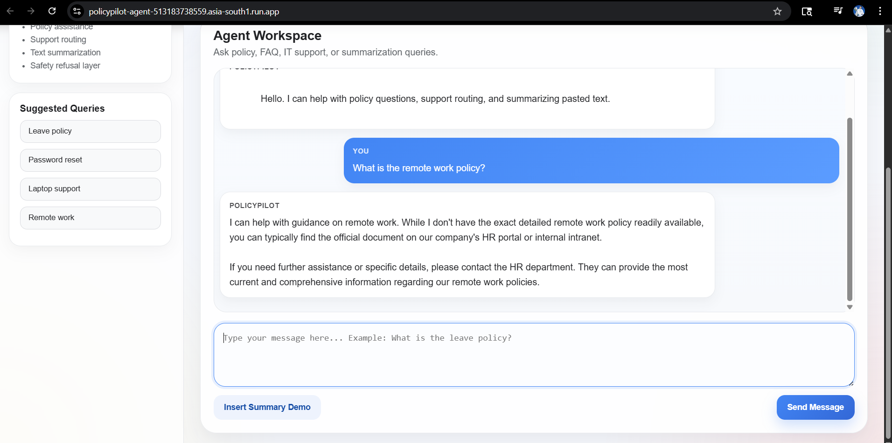
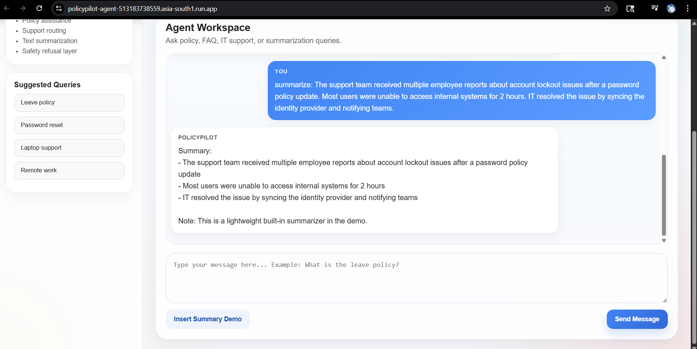

# AI Career Copilot

> GenAI career assistant for resume analysis, interview prep, roadmap generation, and skill growth.

[](https://nextjs.org/)
[](https://react.dev/)
[](https://nodejs.org/)
[](https://expressjs.com/)
[](https://ai.google.dev/)
[](https://render.com/)
[](https://vercel.com/)

[](https://github.com/tauqxxr7/ai-career-copilot)
[](https://ai-career-copilot-45sc.onrender.com)

## Problem

Students and freshers often know how to code but struggle to convert that into a strong resume, realistic skill roadmap, and structured interview preparation. Most tools either give generic advice or stop at surface-level feedback.

## Solution

AI Career Copilot is a full-stack AI product that turns a resume or profile summary into practical next steps. It analyzes strengths and gaps, suggests interview preparation, recommends projects, and generates a focused growth roadmap.

- Built with frontend/backend separation.
- Uses API-based GenAI integration through Gemini.
- Structured for future ATS scoring, roadmap generation, and interview-prep expansion.
- Designed to be deployable on Vercel + Render.

## Features

- Resume analysis UI for pasting profile summaries and resume-style intros
- Resume and profile analysis
- ATS readiness section with AI-powered foundational analysis and ATS scoring planned
- Analysis result output with structured guidance
- Strength and weakness identification
- Skill-gap detection
- Technical and behavioral interview question generation
- Google Gemini AI integration for analysis and recommendations
- 3-month roadmap generation
- Project recommendations
- External job-data enrichment using Remotive Jobs API

## 📸 Screenshots

### Resume Input & Feature Overview
Paste a resume or intro and trigger AI-powered analysis through a clean product interface.



### Analysis Result
Structured output showing resume insights, backend validation, and the current analysis response flow.



## Tech Stack

### Frontend

- Next.js
- React
- Tailwind CSS

### Backend

- Node.js
- Express.js

### AI and Integrations

- Gemini API
- Remotive Jobs API

### Deployment

- Render for backend
- Vercel for frontend

## Architecture

```text
User -> Next.js frontend -> Express API -> Gemini analysis layer -> Remotive jobs enrichment -> structured output -> UI
```

This project is designed for real-world usage and built with a production-style project structure, including separate frontend/backend architecture and environment-based configuration.

## Project Structure

```text
ai-career-copilot/
  backend/
    src/
      config/
      controllers/
      middlewares/
      routes/
      services/
    server.js
  frontend/
    app/
  google-adk-agent/
  docs/
    screenshots/
  README.md
```

## Setup

### 1. Clone the repository

```bash
git clone https://github.com/tauqxxr7/ai-career-copilot.git
cd ai-career-copilot
```

### 2. Start the backend

```bash
cd backend
npm install
copy .env.example .env
npm run dev
```

### 3. Start the frontend

Open a new terminal:

```bash
cd frontend
npm install
copy .env.example .env.local
npm run dev
```

### 4. Open the app

- Frontend: `http://localhost:3000`
- Backend: `http://localhost:5000`

## Environment Variables

### `backend/.env`

```env
GEMINI_API_KEY=your_api_key_here
PORT=5000
REMOTIVE_API_BASE_URL=https://remotive.com/api/remote-jobs
```

### `frontend/.env.local`

```env
NEXT_PUBLIC_API_URL=http://localhost:5000
```

## Screenshots / Demo

### Dashboard Overview



### Policy Response Flow



### Summarization Demo



## Live Demo

- Frontend: `Deployment in progress`
- Backend API: `https://ai-career-copilot-45sc.onrender.com`
- Source code: `https://github.com/tauqxxr7/ai-career-copilot`

## Future Improvements

- Resume upload with PDF parsing
- ATS scoring and rewrite suggestions
- Role-specific guidance flows
- Persistent user sessions
- Better evaluation of recommendation quality

## Author

Built by **Tauqeer Bharde** as part of a broader AI and full-stack portfolio focused on deployability, maintainability, and user experience.

- GitHub: `https://github.com/tauqxxr7`
- LinkedIn: `https://www.linkedin.com/in/tauqeer-sameer-85b868235`

## Suggested GitHub Topics

`ai, genai, llm, gemini-api, full-stack, nextjs, nodejs, react, tailwindcss`
